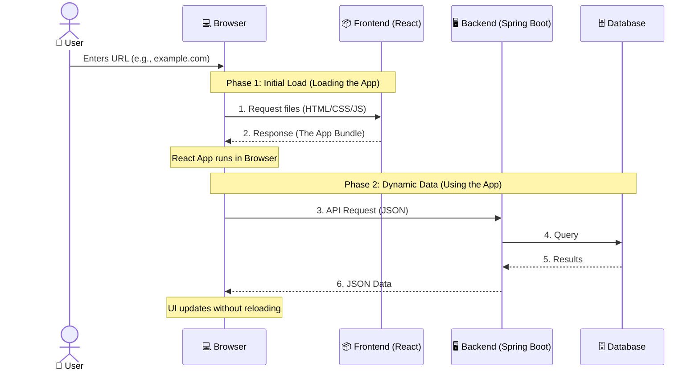

# Introduction to HTML & CSS

## Table of Contents

1. [Web Development Fundamentals](#1-overview-of-web-development-)
2. [HTML – Structure of the Web](#2-html--structure-of-the-web-)  
3. [CSS – Styling the Web](#3-css--styling-the-web-)  

---

## 1. Overview of Web Development 🌐

- **Web Development** is the process of creating websites and web applications.
    - **💻 Website:** A collection of web pages that are mostly **informational** (e.g., a blog, news site, or portfolio).
    - **📱 Web Application:** A complex website designed for **interaction** and specific tasks (e.g., Internet Bank, Gmail, Facebook, Spotify, or Online Banking).
- Every web page you visit is fundamentally made up of **HTML code**.
  **Web Development** is the process of building and maintaining websites or web applications that run in a browser.

---

### 🔄 How the Web Works

Communication in web development happens between two main sides: the **Client** and the **Server**.

*   **🌐 Browser (Client / Front-end):** Where your **React** code and **Tailwind** styles live. It sends requests and renders the UI.
*   **🖥️ Server (Back-end):** Where your **Spring Boot** application runs. It handles the "logic," security, and talks to the database and other services.
*   **📡 HTTP/HTTPS:** The standard "language" (rules) used to exchange data.
    - [**HTTP**](https://www.cloudflare.com/learning/ddos/glossary/hypertext-transfer-protocol-http/) (HyperText Transfer Protocol) is the **protocol** used to send requests and receive responses.
    - [**HTTPS**](https://www.cloudflare.com/learning/ssl/what-is-https/) (HyperText Transfer Protocol Secure) is an encrypted version of HTTP that uses **SSL/TLS** for encryption.
    - [**SSL**](https://www.cloudflare.com/learning/ssl/what-is-ssl/) stands for Secure Sockets Layer, used to secure communication over the internet.
    - [**TLS**](https://www.cloudflare.com/learning/ssl/transport-layer-security-tls/) stands for Transport Layer Security. It is the newer, safer version that replaced SSL.

#### The Lifecycle of a Modern Web App



**What is happening?**

0.  **The Trigger:** It all starts when a **User** types a [**URL**](https://developer.mozilla.org/en-US/docs/Glossary/URL) into the **Browser** and hits Enter.
1.  **Initial Load:** The Browser first talks to the **Frontend "App"** (where your React code is hosted) to download the HTML, CSS, and JavaScript.
2.  **Dynamic Updates:** Once the React app is running in your browser, it sends **API Requests** to the **Backend "App" (Spring Boot)** to fetch or save data (JSON), making the app feel fast and smooth.

---

### 🏗️ Front-end vs Back-end

*   **Front-end (Client-side):** The "Face" of the application. Everything the user sees and interacts with. 
    - **Technologies:** HTML, CSS (**Tailwind**), JavaScript (**React**).
*   **Back-end (Server-side):** The "Brain" of the application. It handles logic, authentication, and database access.
    - **Technologies:** Java (**Spring Boot**), Python, Node.js, and Databases.

## 🛠️ The Three Core Technologies of the Web

To build a modern website, you use three main technologies that work together:

- [**HTML**](https://developer.mozilla.org/en-US/docs/Web/HTML) (**HyperText Markup Language**) – The **Structure**  
  Defines the content and structure of a webpage (headings, paragraphs, images, links, forms).

- [**CSS**](https://developer.mozilla.org/en-US/docs/Web/CSS) (**Cascading Style Sheets**) – The **Presentation**  
  Controls the visual appearance (colors, fonts, spacing, layout, responsiveness).

- [**JavaScript**](https://developer.mozilla.org/en-US/docs/Web/JavaScript) – The **Behavior**  
  Adds interactivity and dynamic functionality (animations, form validation, pop-ups, real-time updates).

---

## 🏠 Think of It Like Building a House

- **HTML** is the foundation, walls, rooms, and doors — it gives the house structure.
- **CSS** is the paint, interior design, lighting, and decoration — it makes the house beautiful.
- **JavaScript** is the electricity, plumbing, and smart systems — it makes things work and respond to you.

---

## 2. HTML – Structure of the Web 🦴

HTML (**HyperText Markup Language**) is the standard language used to create the structure of a web page. It uses **tags** to tell the browser what kind of content to display.

### 2.1 HTML Document Structure

Every HTML document must follow a specific "boilerplate" structure to be recognized by the browser.

```html
<!DOCTYPE html> <!-- 1. Tells the browser this is an HTML5 document -->
<html lang="en"> <!-- 2. The root element (language set to English) -->
<head>
    <meta charset="UTF-8"> <!-- 3. Character encoding (supports most symbols) -->
    <meta name="viewport" content="width=device-width, initial-scale=1.0">
    <title>My First Website</title> <!-- 4. The text shown in the browser tab -->
</head>
<body>
<!-- 5. All visible content goes here -->
<h1>Hello, World!</h1>
</body>
</html>
```

### 2.2 Elements, Tags, and Attributes

An HTML **Element** is usually made of an **opening tag**, some **content**, and a **closing tag**.

```html
<p class="intro">This is a paragraph.</p>
|__| |__________| |__________________| |__|
Tag   Attribute        Content         Tag
```

#### 🏷️ Tags

Tags tell the browser what type of element something is. Most tags come in pairs:

* **Format:** `<tagname> content </tagname>`
* **Example:** `<p>This is a paragraph.</p>`

#### 🧩 Elements

An element is the **complete structure**: `<h1>Hello World</h1>`. This entire line is one HTML element.

#### ⚙️ Attributes

Attributes provide **extra information** about an element. They are always written inside the opening tag.

* **Format:** `<tagname attribute="value">content</tagname>`
* **Example:** `<p class="intro">This is a paragraph.</p>`

#### Common HTML Tags:

* **Headings:** `<h1>` (Main title) down to `<h6>` (Sub-titles).
* **Text:** `<p>` (Paragraph), `<strong>` (Bold), `<em>` (Italic).
* **Links:** `<a href="https://google.com">Click me!</a>` (The `href` attribute is the destination).
* **Images:** `` (**Self-closing** — no `</img>` needed!).
* **Lists:**
    - `<ul>` (Unordered/Bullet points) + `<li>` (Item).
    - `<ol>` (Ordered/Numbered) + `<li>` (Item).
* **Dividers:** `<hr />` (Horizontal Rule).
* **Divisions:** `<div></div>` (Generic container).
* **Buttons:** `<button type="submit">Submit</button>` (Generic button).

### 2.3 Semantic HTML 🏗️

Semantic HTML means using tags that **describe their meaning** to both the browser and the developer. This is great for
[**SEO**](https://developer.mozilla.org/en-US/docs/Glossary/SEO) and accessibility.

**Think of it like labeling a box:**
Instead of just using generic `<div>` (container) tags everywhere, we use:

* `<header>`: For the top section (Logo, Menu).
* `<nav>`: For navigation links.
* `<main>`: For the primary content of the page.
* `<section>`: For a specific group of related content.
* `<article>`: For independent, self-contained content (like a blog post).
* `<footer>`: For the bottom section (Copyright, Contact).

### 2.4 HTML Tables 📊

Tables are used to display data in a grid (rows and columns).

```html

<table>
    <thead>
    <tr>
        <th>Name</th>
        <th>Role</th>
    </tr>
    </thead>
    <tbody>
    <tr>
        <td>User 1</td>
        <td>Developer</td>
    </tr>
    <tr>
        <td>User 2</td>
        <td>Designer</td>
    </tr>
    </tbody>
</table>
```

* `<table>`: The container for the table.
* `<tr>`: **Table Row**.
* `<th>`: **Table Header** (bold and centered by default).
* `<td>`: **Table Data** (regular cell).

Sometimes you need a cell to take up more than one spot.  
**1. `colspan` (Horizontal Merge):** Merges **columns**.  
**2. `rowspan` (Vertical Merge):** Merges **rows**.  

```html

<table>
    <tr>
        <th>Name</th>
        <th colspan="2">Actions</th> <!-- Merges 2 columns -->
    </tr>
    <tr>
        <td>User 1</td>
        <td><a href="#">Edit</a></td>
        <td><a href="#">Delete</a></td>
    </tr>
</table>
```

### 2.5 HTML Forms 📝

Forms are used to collect user input.

```html

<form>
    <!-- 1. Text Inputs -->
    <label for="name">Name:</label>
    <input type="text" id="name" name="user_name" placeholder="Enter your name">

    <label for="email">Email:</label>
    <input type="email" id="email" name="user_email" required>

    <!-- 2. Choices (Radio & Checkbox) -->
    <p>Gender:</p>
    <input type="radio" id="male" name="gender" value="male">
    <label for="male">Male</label>
    <input type="radio" id="female" name="gender" value="female">
    <label for="female">Female</label>

    <p>Interests:</p>
    <input type="checkbox" id="coding" name="interest" value="coding">
    <label for="coding">Coding</label>
    <input type="checkbox" id="music" name="interest" value="music">
    <label for="music">Music</label>

    <!-- 3. Dropdowns -->
    <label for="country">Country:</label>
    <select id="country" name="user_country">
        <option value="sweden">Sweden</option>
        <option value="usa">USA</option>
        <option value="uk">UK</option>
    </select>

    <!-- 4. Long Text -->
    <label for="msg">Message:</label>
    <textarea id="msg" name="user_message" rows="4"></textarea>

    <button type="submit">Register</button>
</form>
```

#### Core Form Elements:

* **`<form>`**: The container for the entire form.
* **`<label>`**: Describes the input. Clicking it focuses the field.
* **`<input>`**: The most versatile tag.
    - `type="text"`: Single line text.
    - `type="email"`: Ensures the input is an email address.
    - `type="password"`: Hides the characters.
    - `type="radio"`: Circular buttons (choose **one** from a group).
    - `type="checkbox"`: Square boxes (choose **multiple** options).
* **`<select>` & `<option>`**: Creates a **dropdown list**.
* **`<textarea>`**: A multi-line text box for longer messages.
* **`<button>`**: Triggers the form submission.

### 2.6 HTML Entities 🔣

Sometimes you need to display characters that have special meaning in HTML (like `<` or `>`) or symbols that aren't on
your keyboard (like `©`). We use **HTML Entities** for this.

Entities always start with an ampersand (`&`) and end with a semicolon (`;`).

|   Symbol   | Meaning            | Entity Name | Entity Number |
|:----------:|:-------------------|:------------|:--------------|
|   **<**    | Less than          | `&lt;`      | `&#60;`       |
|   **>**    | Greater than       | `&gt;`      | `&#62;`       |
|   **&**    | Ampersand          | `&amp;`     | `&#38;`       |
|   **©**    | Copyright          | `&copy;`    | `&#169;`      |
| **&nbsp;** | Non-breaking space | `&nbsp;`    | `&#160;`      |

> **Why use them?** If you type `<` directly, the browser might think you're starting a new HTML tag. Using `&lt;`
> ensures it shows up as text!

#### **Entity Name vs. Entity Number**
- **Entity Name:** Easier to remember (e.g., `&copy;`). However, not all characters have a defined name.
- **Entity Number:** Every character has a unique number (e.g., `&#169;`). Numbers are more robust and universally supported for all characters.

To explore more tags and entities, check out these excellent resources on **W3Schools**:
*   [HTML Elements](https://www.w3schools.com/tags/default.asp)
*   [HTML Entities](https://www.w3schools.com/html/html_entities.asp)

---

### 2.7 HTML Example

Create a page that includes a profile header, a table of courses, and a registration form.

```html
<!DOCTYPE html>
<html lang="en">
<head>
    <meta charset="UTF-8">
    <meta name="viewport" content="width=device-width, initial-scale=1.0">
    <title>Student Profile & Registration</title>
</head>
<body>
<!-- 1. Header Section -->
<header>
    <h1>Lexicon Student Portal</h1>
    <nav>
        <a href="#profile">Profile</a> |
        <a href="#courses">Courses</a> |
        <a href="#register">Register</a>
    </nav>
</header>

<main>
    <!-- 2. Profile Info -->
    <section id="profile">
        <h2>Student Profile</h2>
        
        <p><strong>Name:</strong> [Developer Name]</p>
        <p><strong>Bio:</strong> Aspiring Full-Stack Developer learning HTML, CSS, and Git.</p>
    </section>

    <hr>

    <!-- 3. Course Table -->
    <section id="courses">
        <h2>Current Courses</h2>
        <table border="1">
            <thead>
            <tr>
                <th>Course ID</th>
                <th>Course Name</th>
                <th>Status</th>
            </tr>
            </thead>
            <tbody>
            <tr>
                <td>WD101</td>
                <td>Web Development Basics</td>
                <td>Completed</td>
            </tr>
            <tr>
                <td>JS202</td>
                <td>JavaScript Fundamentals</td>
                <td>In Progress</td>
            </tr>
            </tbody>
        </table>
    </section>

    <hr>

    <!-- 4. Registration Form -->
    <section id="register">
        <h2>Register for a New Course</h2>
        <form action="#" method="POST">
            <label for="student-name">Full Name:</label><br>
            <input type="text" id="student-name" name="name" required><br><br>

            <label for="course-select">Select Course:</label><br>
            <select id="course-select" name="course">
                <option value="react">React Advanced</option>
                <option value="node">Node.js Backend</option>
                <option value="python">Python for Data Science</option>
            </select><br><br>

            <p>Preferred Shift:</p>
            <input type="radio" id="morning" name="shift" value="morning">
            <label for="morning">Morning</label>
            <input type="radio" id="evening" name="shift" value="evening">
            <label for="evening">Evening</label><br><br>

            <button type="submit">Submit Application</button>
        </form>
    </section>
</main>

<footer>
    <p>&copy; 2026 Lexicon Learning Path. All rights reserved.</p>
</footer>
</body>
</html>
```

### 💡 HTML Key Takeaways
*   **Purpose:** Defines the structure and content of the webpage (The "Skeleton").
*   **Tags:** Uses [**Tags**](https://www.w3schools.com/tags/default.asp) to wrap content (e.g., `<p>` and `</p>`).
*   **Attributes:** Provide extra info about elements (e.g., `href`, `src`, `class`).
*   **Semantics:** Use [**Semantic Tags**](https://developer.mozilla.org/en-US/docs/Glossary/Semantics#semantics_in_html) (like `<main>`, `<header>`) for better accessibility and [**SEO**](https://developer.mozilla.org/en-US/docs/Glossary/SEO).
*   **Boilerplate:** Every page needs a standard structure (`<!DOCTYPE html>`, `<html>`, `<head>`, `<body>`).

## 3. CSS – Styling the Web 🎨

CSS (**Cascading Style Sheets**) is the language used to style the HTML skeleton. It controls everything from colors and fonts to layouts and animations.

> **🚀 See it in Action:** Check out this [CSS Interactive Demo](https://www.w3schools.com/css/demo_default.htm) to see how the same HTML can look completely different with different CSS styles!

### 3.1 Introduction to CSS
CSS works by selecting an HTML element and applying "rules" to it.

#### 🏗️ The CSS Syntax
A CSS rule is made of three main parts:
1.  **Selector:** The element you want to style (e.g., `h1`).
2.  **Property:** The thing you want to change (e.g., `color`).
3.  **Value:** The setting you want to apply (e.g., `blue`).

```css
h1 {
    color: blue;
    font-size: 20px;
}
```

#### 🔗 Three Ways to Add CSS
There are three ways to connect your styles to your HTML:

1.  **Inline CSS:** Written directly inside the HTML tag (Not recommended for large projects).
    ```html
    <h1 style="color: red;">Hello!</h1>
    ```
2.  **Internal CSS:** Written inside a `<style>` tag in the `<head>` section.
    ```html
    <head>
        <style>
            h1 { color: green; }
        </style>
    </head>
    ```
3.  **External CSS:** Written in a separate `.css` file and linked in the `<head>` (The **Best Practice**).
    ```html
    <head>
        <link rel="stylesheet" href="style.css">
    </head>
    ```

> **💡 Pro Tip:** Always use **External CSS**. It keeps your code organized and allows you to use the same styles for many different pages!

---

### 3.2 Common CSS Properties
Properties are the specific styles you apply to an element. Here are the most common ones:

> **🔗 Reference:** For a complete list of all available styles, check out the [**CSS Properties Reference**](https://www.w3schools.com/cssref/index.php).

#### 🎨 Colors & Backgrounds
*   `color: red;` (Changes text color)
*   `background-color: #f4f4f4;` (Changes the background color)
*   `opacity: 0.5;` (Transparency from 0.0 to 1.0)

#### 📝 Typography (Text)
*   `font-family: 'Arial', sans-serif;` (Sets the font)
*   `font-size: 16px;` (Sets text size)
*   `font-weight: bold;` (Sets thickness)
*   `text-align: center;` (Aligns text horizontally)
*   `text-decoration: none;` (Removes underlines from links)

#### 📏 Dimensions & Box Model
*   `width: 100%;` / `height: 500px;`
*   **`padding`**: Space **inside** the element (between content and border).
*   **`margin`**: Space **outside** the element (between this and other elements).
*   **`border`**: The line around the padding (e.g., `5px solid black`).
*   **`box-sizing: border-box;`**: (**Crucial!**) Makes sure padding doesn't increase the total width of your box.

---

### 3.3 CSS Selectors
Selectors are the patterns used to "target" or "find" the HTML elements you want to style. They act as the link between your HTML structure and your CSS design rules.

**Why do we need them?**
*   **🎯 Precision:** You can style exactly what you want—whether it's one specific button or every single paragraph on the page.
*   **♻️ Reusability:** You can define a style once and apply it to multiple elements, saving time and keeping your code "DRY" (Don't Repeat Yourself).
*   **🧹 Organization:** By using selectors, you keep your content (HTML) separate from your presentation (CSS), making your website much easier to update and maintain.

#### 1. Element Selector
Targets all elements of a specific type by using their **HTML tag name** (like `h1`, `p`, or `div`). This is the most direct way to apply styles to **every instance** of a tag across your entire page.
```css
/* Styles all <p> elements on the page */
p {
    color: gray;
}
```

#### 2. Class Selector
Targets elements with a specific `class` attribute. Classes are **reusable**, meaning you can apply the same class to many different elements across your page. In CSS, class selectors start with a **dot (`.`)**.
```css
/* Styles any element with class="highlight" */
.highlight {
    background-color: yellow;
}
```

#### 3. ID Selector
Targets a **single, unique** element with a specific `id` attribute. Unlike classes, an ID can only be used **once per page**, making it perfect for unique elements like a navigation bar or a footer. In CSS, ID selectors start with a **hash (`#`)**.
```css
/* Styles the unique element with id="navbar" */
#navbar {
    background-color: black;
    color: white;
}
```

#### 4. Universal Selector
Targets **every single element** on the page. In CSS, it is represented by an **asterisk (`*`)**. It is commonly used to "reset" default browser styles, such as removing default margins and paddings from all elements at once.
```css
/* Resets margins and paddings for ALL elements */
* {
    margin: 0;
    padding: 0;
}
```

#### 5. Grouping Selector
Allows you to apply the **same set of styles** to multiple different selectors at the same time. This is a great way to reduce code repetition and keep your CSS file smaller. In CSS, selectors in a group are separated by a **comma (`,`)**.
```css
/* Styles all h1, h2, and h3 elements together */
h1, h2, h3 {
    font-family: Arial, sans-serif;
}
```

> **⚖️ Specificity (The Hierarchy):**  
> If multiple rules target the same element, CSS follows this order of power:  
> **ID (`#`) > Class (`.`) > Element (`p`)** > *An ID style will always beat a Class style!*

---

### 3.4 CSS Variables 📦
CSS variables (also known as **Custom Properties**) allow you to store specific values (like colors, fonts, or sizes) and reuse them throughout your entire stylesheet.

**Why use them?**
*   **🎨 Consistency:** Use the same color across many elements without remembering the hex code.
*   **🛠️ Easy Maintenance:** If you want to change your "primary color," you only need to update it in one place.
*   **🧠 Readability:** Use descriptive names like `--main-bg-color` instead of obscure codes like `#2c3e50`.

#### How to use CSS Variables:
1.  **Declare them:** Usually inside the `:root` selector so they are available globally.
2.  **Use them:** With the `var()` function.

```css
/* 1. Declaration */
:root {
    --primary-color: #3498db;
    --main-padding: 20px;
}

/* 2. Usage */
button {
    background-color: var(--primary-color);
    padding: var(--main-padding);
}

h1 {
    color: var(--primary-color);
}
```

> **💡 Fun Fact:** CSS variables are dynamic! Unlike pre-processor variables (like in Sass), they can be updated in real-time using JavaScript.
